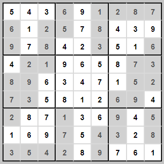

# Project Sudoku
MVP: Create a sudoku web application where a user could log in, start a timer (optional), solve a sudoku, check the solution and get (if correct) the solving time & the username displayed on the leaderboard. 

## :brain: Learning objectives
- practice React/Redux, vanilla JavaScript and Node.js, learned during the bootcamp
- how to work with 2D arrays
- how to structure, design & execute a project on my own
- enjoy the learning process!

## :heavy_check_mark: Features
Frontend:
- sign up & login form
- sudoku puzzle with predefined number slots disabled
- timer to start and pause the time
- function to check if the solution is correct or not (comparison of two 2D arrays)
- timed & correct solutions are added to the leaderboard  
- leaderboard displaying top 10 users and their shortest solving times

Backend:
- database with user and leaderboard collection
- user collection keeping the data about the users (username, pw, email)
- leaderboard collection keeping the username and the solving time 

## :chart_with_upwards_trend: Future improvements
- go back button
- display a numeric keypad for entering the digits
- add more sudoku puzzles
- save the sudoku puzzles in a database
- write a sudoku solver function

## :robot: Tech used 
- JavaScript
- React/Redux
- mongoose
- Postman
- MongoDB
- Mongo Atlas
- Material UI
- styled components

## :eyes: View it live
- Backend: https://rebeka-project-sudoku.herokuapp.com/
- Frontend: https://rebeka-sudoku-app.netlify.app/

## :key: Sudoku solution

